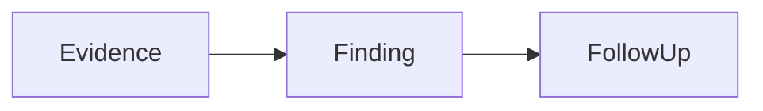

# Vigil

Vigil is a local Repository Intelligence Monitor for real GitHub and Gerrit repositories. It persists an explicit watchlist and produces on-demand repository reports, Hot Change collections, and Snoop evidence.

## Run locally

```bash
npm install
npm run dev
```

Build a production bundle with:

```bash
npm run build
```

## Current scope

This repository contains an interactive frontend plus a small local analysis API:

- persistent repository watchlist with GitHub/Gerrit address inspection and branch selection;
- a configurable workspace for on-demand Git mirrors and analysis artifacts;
- OpenAI-compatible provider configuration, `/models` connection testing, and real `chat/completions` Deep Dive execution;
- per-repository time-range reports with exact-range disk caching and Markdown/JSON downloads;
- GitHub Hot PR and Gerrit Hot Change scoring with evidence-oriented Snoop collection;
- optional full local clones that preserve the selected branch and support explicit refresh;
- a status endpoint and UI that report observed local configuration without exposing secrets;
- a digital-human adapter boundary without coupling Vigil to Flyclaw's evolving employee contract.

No demo repositories, PRs, users, audit events, quotas, health percentages, signals, topics, or Window reports are bundled. Pages without a real backing pipeline render an explicit empty state. Continuous scheduled ingestion, derived cross-repository signals/topics, Window publishing, PAM/session/RBAC, quotas, and audit persistence remain product boundaries.

## First administrator

Vigil does not allow browser-based first-user setup. Start the service with these two server-side environment variables; the first start creates a persistent scrypt-hashed admin record in `.vigil/users.json`:

```bash
export VIGIL_ADMIN_USERNAME='vigil-admin'
export VIGIL_ADMIN_PASSWORD='use-a-unique-password-of-at-least-12-characters'
npm run dev
```

The public site can read the persisted watchlist, system status, and generated report downloads without login. Administrator login is required for provider/settings access and any operation that adds/syncs repositories or spends collection/provider quota. For HTTPS deployments also set `VIGIL_SESSION_SECURE=true` so the session cookie is marked Secure. Keep the password only in the service manager or server secret store; it is never returned by the API.

## Analysis configuration

Open **访问与系统 → 分析引擎** to configure:

- an absolute Workspace directory;
- OpenAI-compatible `base_url`, model, timeout, and Deep Dive thresholds;
- a Provider API Key entered by an authenticated administrator.

The API key is sent only to the local Vigil API over the authenticated session. It is encrypted with AES-256-GCM before being written to `.vigil/provider-secret.json`; the local encryption key is kept separately in `.vigil/provider-secret.key`, both mode `0600`. The settings API and browser state only receive a configured/not-configured status, never the key value. Non-secret settings are written to `.vigil/analysis.json`; the configured Workspace receives `repositories/` and `artifacts/` directories.

Deep Dive uses GitHub/Gerrit metadata for discovery, then performs a mirror clone/fetch only after a change is selected. Change refs are diffed inside the configured Workspace before the bounded context is sent to the provider.

For higher GitHub API limits, set the environment variable configured under **GitHub Collection**:

```bash
export GITHUB_TOKEN=...
```

For an authenticated Gerrit server, configure the environment-variable names under **Gerrit Collection**, then provide the corresponding values before startup:

```bash
export GERRIT_USERNAME=...
export GERRIT_HTTP_PASSWORD=...
```

The add flow accepts GitHub `owner/repository`, GitHub HTTPS URLs, Gerrit HTTPS/SSH clone URLs, Gerrit repository pages, and Gerrit Change URLs. It probes `refs/heads/*`, requires a branch selection, and persists the selected source and branch in `<workspace>/watchlist.json` with mode `0600`.

Each watch can remain **On demand** or enable **Full local sync**. Full sync creates a normal, complete Git working copy under `<workspace>/repositories/full/<repository-id>`, checks out the persisted branch, fetches tags and remote refs on subsequent syncs, and records `syncStatus`, `localPath`, `headSha`, and `lastFullSync` in the watchlist. Updates are fast-forward only so Vigil does not discard local changes inside the managed working copy.

Repository summaries are keyed by the exact tuple `source type + host + project + branch + from + to`. The first request writes both JSON evidence and a readable Markdown report under `artifacts/repository-summaries/`; later requests for the same tuple return the cached report unless `force: true` is requested. Both formats are downloadable from the Repository Intelligence page.

The report reader renders CommonMark/GFM, tables, task lists, standard LaTeX math, and these fenced visual blocks:

````markdown


```echarts
{"xAxis":{"type":"category","data":["PR-1","PR-2"]},"yAxis":{"type":"value"},"series":[{"type":"bar","data":[12,27]}]}
```

```katex
Risk = \frac{changed\ lines}{review\ coverage}
```
````

Mermaid runs in strict security mode, ECharts accepts a JSON option object only, and report Markdown does not render raw HTML or executable JavaScript.

Snoop collects GitHub PR bodies/files/commits/reviews/comments/check runs or Gerrit Change revisions/files/messages/inline comments/labels. Bodies, patches, item counts, and request time are bounded to protect the service.

## Digital-human adapter

[`server/digital-human-adapter.js`](server/digital-human-adapter.js) reserves three contract-neutral methods:

- `listAvailable()`
- `resolveBinding(bindingRef)`
- `invokeDeepDive(binding, input, repositoryContext)`

The current adapter is intentionally unconfigured. It can later be replaced with the finalized digital-human contract without changing the Vigil Deep Dive pipeline.
