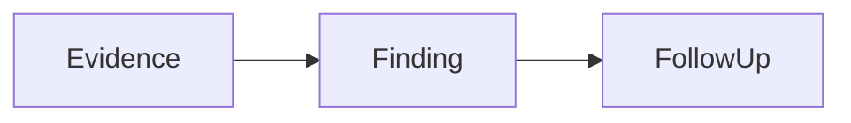

# Vigil

Vigil is a local Repository Intelligence Monitor for real GitHub and Gerrit repositories. It persists an explicit watchlist, produces on-demand repository reports, publishes scheduled cross-repository Windows, and can turn closed daily evidence into durable Technical Signals and Technical Topics through Dream.

## Run locally

```bash
npm install
npm run dev
```

Dream requires Node.js `>= 24.15.0` for the built-in SQLite ledger. Dream remains disabled unless explicitly enabled; the rest of Vigil continues to use its existing local workflow.

Build a production bundle with:

```bash
npm run build
```

## Current scope

This repository contains an interactive frontend plus a small local analysis API:

- persistent repository watchlist with GitHub/Gerrit address inspection and branch selection;
- a configurable workspace for on-demand Git mirrors and analysis artifacts;
- OpenAI-compatible provider configuration, `/models` connection testing, and real `chat/completions` Deep Dive execution;
- per-repository time-range reports with exact-range disk caching and Markdown/JSON downloads;
- GitHub Hot PR and Gerrit Hot Change scoring with evidence-oriented Snoop collection;
- optional full local clones that preserve the selected branch and support explicit refresh;
- a status endpoint and UI that report observed local configuration without exposing secrets;
- a local scheduled Window pipeline with durable run records, Markdown/JSON artifacts, per-repository isolation, retries, and SSE event replay;
- a Window Rail that shows real pipeline events live and replays the persisted archive after publication;
- a bounded daily Dream pipeline with Host-controlled evidence, duplicate suppression, append-only Signal/Topic revisions, forecast evaluation, atomic SQLite commits, and explicit no-finding/blocked outcomes;
- compact Technical Signal and Technical Topic ledger views with evidence, corrections, linked entities, and operational freshness states;
- a digital-human adapter boundary without coupling Vigil to Flyclaw's evolving employee contract.

No demo repositories, PRs, users, audit events, quotas, health percentages, Signals, Topics, or Window reports are bundled. A successful Dream may honestly publish no finding. PAM/session/RBAC expansion, quotas, audit persistence, cross-workspace reasoning, arbitrary agent tools, and outbound delivery remain product boundaries.

## First administrator

Vigil does not allow browser-based first-user setup. Start the service with these two server-side environment variables; the first start creates a persistent scrypt-hashed admin record in `.vigil/users.json`:

```bash
export VIGIL_ADMIN_USERNAME='vigil-admin'
export VIGIL_ADMIN_PASSWORD='use-a-unique-password-of-at-least-12-characters'
npm run dev
```

The public site can read the persisted watchlist, system status, and generated report downloads without login. Administrator login is required for provider/settings access and any operation that adds/syncs repositories or spends collection/provider quota. For HTTPS deployments also set `VIGIL_SESSION_SECURE=true` so the session cookie is marked Secure. Keep the password only in the service manager or server secret store; it is never returned by the API.

## Analysis configuration

Open **访问与系统 → 分析引擎** to configure:

- an absolute Workspace directory;
- OpenAI-compatible `base_url`, model, timeout, and Deep Dive thresholds;
- a Provider API Key entered by an authenticated administrator.

Provider API keys and GitHub Tokens are sent only to the local Vigil API over the authenticated session. Each is encrypted with AES-256-GCM before being written to `.vigil/*-secret.json`; its local encryption key is kept separately in `.vigil/*-secret.key`, both mode `0600`. The settings API and browser state only receive a configured/not-configured status, never the key value. Non-secret settings are written to `.vigil/analysis.json`; the configured Workspace receives `repositories/` and `artifacts/` directories.

Deep Dive uses GitHub/Gerrit metadata for discovery, then performs a mirror clone/fetch only after a change is selected. Change refs are diffed inside the configured Workspace before the bounded context is sent to the provider.

For higher GitHub API limits and private repository access, paste a fine-grained GitHub Token into **GitHub Collection** and save. It is not read from an environment variable and is never displayed after saving.

For an authenticated Gerrit server, configure the environment-variable names under **Gerrit Collection**, then provide the corresponding values before startup:

```bash
export GERRIT_USERNAME=...
export GERRIT_HTTP_PASSWORD=...
```

The add flow accepts GitHub `owner/repository`, GitHub HTTPS URLs, Gerrit HTTPS/SSH clone URLs, Gerrit repository pages, and Gerrit Change URLs. It probes `refs/heads/*`, requires a branch selection, and persists the selected source and branch in `<workspace>/watchlist.json` with mode `0600`.

Each watch can remain **On demand** or enable **Full local sync**. Full sync creates a normal, complete Git working copy under `<workspace>/repositories/full/<repository-id>`, checks out the persisted branch, fetches tags and remote refs on subsequent syncs, and records `syncStatus`, `localPath`, `headSha`, and `lastFullSync` in the watchlist. Updates are fast-forward only so Vigil does not discard local changes inside the managed working copy.

Repository summaries are keyed by the exact tuple `source type + host + project + branch + from + to`. The first request writes both JSON evidence and a readable Markdown report under `artifacts/repository-summaries/`; later requests for the same tuple return the cached report unless `force: true` is requested. Both formats are downloadable from the Repository Intelligence page.

## Scheduled Windows and Window Rail

Open **访问与系统 → 分析引擎** and configure **Window Schedule** after adding at least one watch repository. Scheduling is disabled by default. Its default calendar is `Asia/Shanghai` and publishes at `00:00`, `08:00`, and `16:00`; each boundary closes the preceding half-open interval, for example the `08:00` publication covers `[00:00, 08:00)` in that timezone.

You can change the IANA timezone, publication times, repository concurrency, catch-up limit, and maximum attempts. Saving an enabled schedule immediately scans for closed, unpublished Windows. On process restart Vigil recovers stale running records and catches up closed intervals in chronological order; it never creates the current unfinished interval early. This is a local single-process scheduler, so run one Vigil API process for a workspace.

For every Window, Vigil snapshots the watchlist, runs full-sync watches through the existing Git pipeline, collects each source over the exact Window range, and persists repository reports. Repository errors are isolated:

- all repositories succeed → `published`;
- at least one succeeds and at least one fails → `degraded`, with the failures included in the report;
- none succeeds → `failed`, with persisted exponential retry state (starting at five minutes).

Every Window is identified by its UTC range and stored in `<workspace>/window-runs.json`. Its readable and machine-readable aggregate artifacts are written to `<workspace>/artifacts/windows/<window-id>/window.md` and `window.json`. The **Window 档案** page replays those persisted events; a running Window receives the same sanitized events via SSE. Event details and reports never include access tokens or provider keys.

The local API also exposes `GET /api/windows`, `GET /api/windows/:id`, replaying `GET /api/windows/:id/events`, downloads at `GET /api/windows/:id/download?format=markdown|json`, plus administrator-only `POST /api/windows/trigger` and `POST /api/windows/:id/retry` operations.

DingTalk delivery is intentionally not included yet. The current implementation produces and archives the Window locally; an outbound robot/webhook delivery layer can be added later without changing the scheduler, ledger, or report contract.

## Daily Dream, Technical Signals, and Technical Topics

Dream consumes durable daily evidence only after a local-midnight Window has been published. It first scouts a small candidate set, then lets the Host resolve only pre-authorized evidence, and finally asks the configured Provider for one strict Dream v2.1 batch. The Host validates all IDs, evidence references, ledger versions, fingerprints, forecast closures, and context hashes before an atomic SQLite commit.

Open **访问与系统 → 分析引擎** to configure Dream. Automatic readiness requires:

- Window scheduling enabled with a `00:00` boundary;
- the same IANA timezone for Window and Dream;
- a durable `published` or `degraded` midnight Window;
- a ready OpenAI-compatible Provider;
- Node.js `>= 24.15.0` and a writable Workspace.

Dream is disabled by default. Saving an enabled configuration scans up to the configured catch-up days in chronological order. **Dream now** runs only the most recent eligible closed day. A `no_finding` or `duplicate_only` day is a valid completion and advances the cursor; a blocked or failed run never advances the cursor and can be retried after the cause is fixed.

The authoritative ledger is `<workspace>/dream.sqlite3`. It keeps stable identities, fingerprint aliases, revisions, evidence, candidate dispositions, forecasts/evaluations, leases, run audit, and the accepted cursor. Public Signal/Topic APIs expose safe projections without raw snippets, prompts, local paths, or secrets; authenticated run detail retains bounded diagnostic context.

See [Dream architecture](docs/dream/architecture.md) for the reasoning and persistence contract, and [Dream operations](docs/dream/operations.md) for settings, manual trigger/retry, diagnosis, backup, recovery, rollback, and remote rollout gates.

The report reader renders CommonMark/GFM, tables, task lists, standard LaTeX math, and these fenced visual blocks:

````markdown


```echarts
{"xAxis":{"type":"category","data":["PR-1","PR-2"]},"yAxis":{"type":"value"},"series":[{"type":"bar","data":[12,27]}]}
```

```katex
Risk = \frac{changed\ lines}{review\ coverage}
```
````

Mermaid runs in strict security mode, ECharts accepts a JSON option object only, and report Markdown does not render raw HTML or executable JavaScript.

Snoop collects GitHub PR bodies/files/commits/reviews/comments/check runs or Gerrit Change revisions/files/messages/inline comments/labels. Bodies, patches, item counts, and request time are bounded to protect the service.

## Digital-human adapter

[`server/digital-human-adapter.js`](server/digital-human-adapter.js) reserves three contract-neutral methods:

- `listAvailable()`
- `resolveBinding(bindingRef)`
- `invokeDeepDive(binding, input, repositoryContext)`

The current adapter is intentionally unconfigured. It can later be replaced with the finalized digital-human contract without changing the Vigil Deep Dive pipeline.
