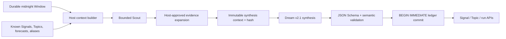

# VIGIL Dream architecture

Dream is VIGIL's bounded daily reasoning pipeline. It converts durable repository Windows into two different products:

- a **Technical Signal** is a sustained or correcting change in engineering direction, such as adoption, hardening, migration, optimization, or increasing risk;
- a **Technical Topic** is a deeper technical thesis whose mechanism, applicability, boundaries, implications, and unresolved questions are supported by one or more Signals.

Neither object is a daily quota. A successful day may publish `no_finding`, and weak or duplicate candidates must not be promoted merely to fill the UI.

## Data flow and trust boundary

The Host owns identity, time, source access, limits, context hashing, evidence IDs, issued entity IDs, ledger versions, cursor movement, and persistence. The provider can only select from Host-issued IDs and Host-bound evidence. Repository text is untrusted data wrapped in explicit prompt delimiters; it cannot grant tools, change the protocol, or authorize arbitrary URLs, paths, or code execution.

Dream uses two provider calls:

1. The Scout ranks a bounded number of candidates and may request only evidence locators already present in the Host manifest.
2. Synthesis receives the complete candidate-relevant known state and the Host-resolved evidence catalog. It emits one strict JSON batch conforming to `dream-batch.schema.json`.

The runtime loads [`skills/vigil-dream/SKILL.md`](../../skills/vigil-dream/SKILL.md) as the authoritative reasoning instruction. The schema and validator are not merely prompt documentation: both Python and JavaScript validators enforce the same context-bound invariants before persistence.

## Evidence model

GitHub and Gerrit inputs normalize into source-neutral kinds such as `commit`, `code_review`, `issue`, `release`, `test`, `diff`, `window_summary`, and `repository_summary`. Provider-specific immutable locators remain metadata, while evidence identity is derived by the Host from a canonical source key.

Every accepted factual statement references known `ev-*` IDs. The validator rejects unknown evidence, invented run fields, IDs that were not issued for their type, impossible suppression lineage, stale ledger versions, and mismatched context hashes. Public projections include bounded claims and safe locator labels, but exclude raw snippets, source keys, content hashes, prompts, local paths, and provider output.

## Identity, deduplication, and correction

Signals and Topics have stable UUID identities, a current canonical fingerprint, append-only fingerprint aliases, and append-only revisions. The complete known ledger is supplied during synthesis, so a candidate must be classified as create, update, supersede, duplicate, or no material change. Fingerprints are unique in SQLite; a collision is rejected even if model-side comparison failed.

A Signal revision records baseline, observed delta, mechanism, engineering consequence, facts, inferences, counter-evidence, unknowns, next checks, and forecasts. Forecasts are immutable claims with a due time. Later runs append one evaluation—confirmed, refuted, or inconclusive—rather than rewriting the original prediction. A correction is therefore visible as history, not silently replaced state.

A Topic revision records a technical thesis, scope, mechanism, applicability, boundaries, linked Signals, evidence-backed findings, engineering implications, unknowns, and next checks. Topics are created only when the evidence supports a durable investigation beyond one isolated change.

## Persistence and execution semantics

The authoritative ledger is `<workspace>/dream.sqlite3`, using built-in `node:sqlite`, WAL mode, foreign keys, and `BEGIN IMMEDIATE` transactions. Its relational projections cover:

- scope cursor and Signal/Topic/Evidence versions;
- Dream runs, lease ownership, stage, diagnostics, prepared context, provider output, and accepted batch;
- canonical evidence;
- Signal/Topic current projections, aliases, revisions, and links;
- forecasts and append-only evaluations;
- candidate disposition audits.

One `(scope, daily horizon, protocol version)` idempotency key owns a run. A live lease prevents concurrent owners. Commit compares the prepared cursor and ledger versions, writes the full accepted batch in one transaction, and moves the cursor last. Parse, validation, lease, concurrency, foreign-key, or SQLite failures leave the prior ledger and cursor unchanged.

Run outcomes have distinct meanings:

| Outcome | Ledger mutation | Cursor |
| --- | --- | --- |
| `findings` | Create or revise validated entities | Advances |
| `state_updated` | Correct or close known state without a new discovery | Advances |
| `duplicate_only` | Candidate audit only | Advances |
| `no_finding` | No entity revision | Advances |
| `blocked_incomplete_sources` | Diagnostic run only | Does not advance |
| runtime `failed` | Sanitized failure only | Does not advance |

## Scheduling and product projections

Dream runs once for each closed local-calendar day, after a short configurable delay from local midnight. Automatic readiness requires the Window schedule to be enabled, contain `00:00`, use the same IANA timezone, and have a durable `published` or `degraded` midnight Window for the horizon. Catch-up walks oldest eligible days first. Retry state is durable and bounded.

Public list/detail APIs project current Signals and Topics plus revision, forecast, link, and safe evidence metadata. Run details expose raw prepared context and provider output only to an authenticated administrator. The UI deliberately distinguishes disabled, unavailable, never-run, running, no-finding, blocked, failed, filtered-empty, and healthy states.

Dream stays disabled by default. It does not alter Window collection semantics, execute repository code, run benchmarks, contact arbitrary sources, send outbound notifications, or coordinate across separate VIGIL workspaces.
