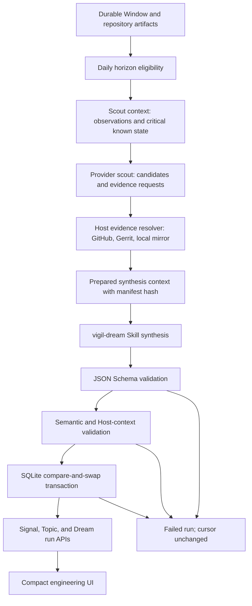
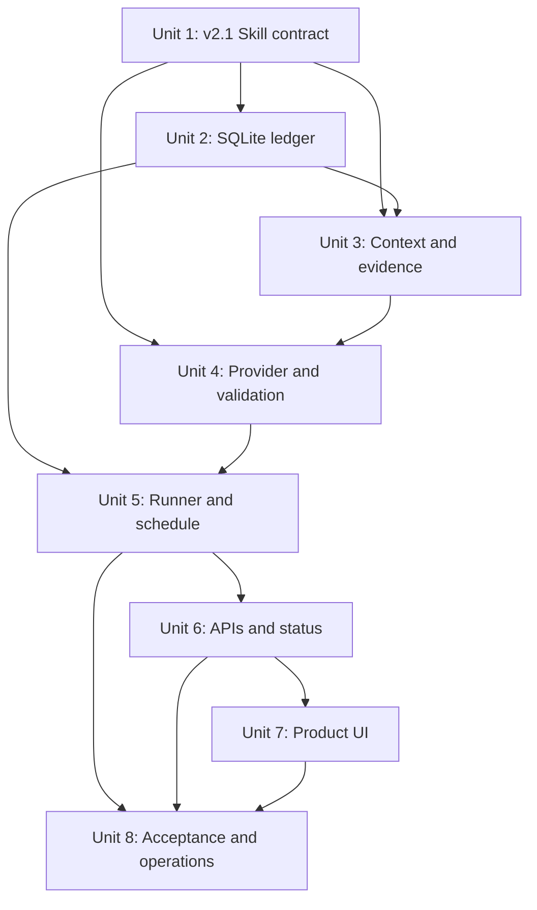
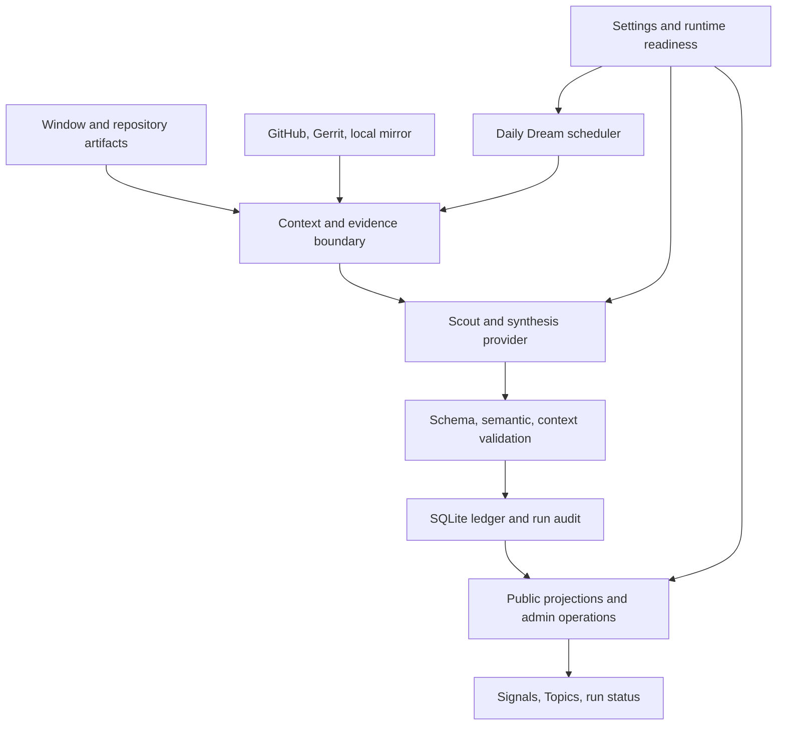

# feat: Add the VIGIL Dream signal and topic runtime

## Overview

Add a daily, skill-guided Dream pipeline that turns durable VIGIL Window observations into evidence-backed Technical Signals and, when justified, deeper Technical Topics. The pipeline must remember prior findings, evaluate earlier forecasts, record correction or divergence, and reject duplicate or invented discoveries before they become visible in the product.

This is a Deep plan because it adds a persistent domain model, a two-stage provider workflow, daily scheduling, validation and trust boundaries, GitHub/Gerrit evidence normalization, public APIs, and two user-facing projections. The user-provided `vigil-dream-v2-source.zip` is the design input; it will be hardened into a VIGIL-specific v2.1 contract before runtime integration. Its generic implementation prompt is not a drop-in implementation specification and will not be shipped inside the runtime Skill.

## Problem Frame

The Technical Signals and Technical Topics views are empty because VIGIL currently stops at repository and Window summaries. It has no durable reasoning loop that compares new observations with prior beliefs, no identity or revision model for long-lived findings, and no scheduler that converts accumulated summaries into new knowledge.

Dream needs to solve two related but distinct jobs:

| Mode | Question answered | Valid daily result |
|---|---|---|
| Signal detection | Is a meaningful technical trend emerging, strengthening, weakening, or contradicting an earlier forecast? | Zero or more signal changes, with explicit no-finding allowed |
| Topic excavation | Does the evidence justify a durable technical investigation or an update to an existing one? | Link/update/create one or more topics, or explicitly choose none |
| Forecast review | Did a previously predicted checkpoint arrive, and was the prediction supported, contradicted, or still blocked? | An append-only evaluation that closes the due forecast or records why it could not be evaluated |

Daily output quality is more important than filling the UI. An honest no-finding completes the day successfully; a blocked run is a valid diagnostic outcome that keeps the day pending. Forcing a Signal or Topic from weak evidence is a failure.

## Requirements Trace

- **R1. Daily Dream:** Process each completed local-calendar day once, using only durable Window and repository artifacts inside the closed horizon; automatic readiness requires a Window boundary at local `00:00`.
- **R2. Meaningful technical discovery:** Distinguish trend-level Technical Signals from deeper, durable Technical Topics; permit zero findings.
- **R3. Known-state reasoning:** Include existing Signals, Topics, aliases, links, forecasts, and prior evaluations as known state so Dream can update or suppress instead of rediscovering.
- **R4. Forecast correction:** Evaluate every due or touched open forecast and make support, contradiction, uncertainty, and revised forecasts visible as append-only history.
- **R5. Evidence trust boundary:** The Host owns the run envelope, input manifest, evidence catalog, canonical source identity, and issued IDs. Model output may reference but may not invent direct evidence.
- **R6. Duplicate resistance:** Combine exact database uniqueness, fingerprint aliases, canonical evidence lineage, and candidate-to-known comparison; record why suppressed candidates were duplicates.
- **R7. Atomic and idempotent state:** A validated Dream batch and its ledger changes commit in one transaction; failure never advances the cursor or partially mutates a ledger.
- **R8. Source parity:** Normalize GitHub and Gerrit observations into one source-neutral evidence contract while preserving provider-specific locators such as commit SHA, pull request, change, and patchset.
- **R9. Skill-guided execution:** Package the reasoning procedure, schema, validator, examples, and bounded rules as the `vigil-dream` Skill, with structural, semantic, and Host-context validation before persistence.
- **R10. Product visibility:** Replace the empty Signal and Topic states with compact engineering-oriented list/detail/revision views, plus enough Dream run status to explain freshness, no-finding, blocked, and failed states.
- **R11. Local acceptance:** Validate on the local VIGIL workspace, including a bounded trial that attempts at most one new Signal and one Topic from real stored evidence; never fabricate either to satisfy the cap.
- **R12. Operability:** Keep Dream disabled by default, expose readiness and last-run health, support a safe manual trigger, bound provider context/output, and document recovery.

## Scope Boundaries

- Do not add a general-purpose autonomous Agent Loop or arbitrary shell/tool execution. Dream is a bounded two-stage workflow with Host-controlled evidence expansion.
- Do not replace or change existing Window collection, report generation, or scheduling semantics.
- Do not treat generated summaries as direct source-code proof. Their provenance remains explicit, and stronger claims require Host-resolved repository evidence.
- Do not use embeddings or require SQLite FTS5 in the first delivery. Exact identity plus deterministic lexical retrieval is sufficient for the initial known-state projection and avoids deployment capability drift.
- Do not migrate the current untracked v1 trial JSON files into production ledgers. They are review artifacts, not authoritative state.
- Do not force daily findings, auto-delete history, or rewrite a prior revision in place.
- Do not deploy to the remote environment as part of this implementation. Verification is local; remote rollout remains an explicit follow-up after local acceptance.
- Do not broaden this work into multi-workspace tenancy. Persist a workspace/repository scope key so the schema does not preclude it later.

### Deferred to Separate Tasks

- Semantic or embedding-based retrieval for very large ledgers: add only after observed ledger size or duplicate-rate metrics show deterministic retrieval is insufficient.
- Cross-repository Signals that span separate VIGIL workspaces: future design after single-workspace identity and evidence rules are stable.
- Automated code execution, benchmarks, or experiment orchestration for Topic research: separate security and sandboxing work.

## Context & Research

### Relevant Code and Patterns

- `server/window-schedule.js` defines timezone-aware, closed Window ranges and is the scheduling pattern to reuse without coupling Dream to process-local Window internals.
- `server/window-scheduler.js` provides catch-up, retry, trigger, and status behavior to mirror at the API boundary; Dream claims must be database-backed rather than process-only.
- `server/window-runner.js` already persists per-repository and aggregate artifacts and exposes `published`, `degraded`, and `failed` terminal states.
- `server/window-store.js`, `server/reports.js`, and `server/window-reports.js` establish VIGIL's current artifact naming and atomic file-write conventions. Dream will retain raw JSON artifacts for audit while using SQLite as its authoritative relational ledger.
- `server/repository-source.js`, `server/github.js`, and `server/gerrit.js` are the source-specific boundaries from which canonical GitHub/Gerrit evidence locators should be derived.
- `server/provider.js` is a single OpenAI-compatible completion adapter. Dream should add a dedicated structured adapter rather than complicating existing summary prompts.
- `server/config.js` persists operational settings in `.vigil/analysis.json`; Dream settings should follow this convention rather than become environment-only configuration.
- `server/system-status.js` and `server/index.js` are the established readiness/status and route composition surfaces.
- `src/App.jsx`, `src/api.js`, and `src/styles.css` contain the existing view, API-client, and dense engineering UI patterns that the Signal and Topic projections must extend.
- The repository has no database, migration, Skill loader, or durable Agent loop today. This is a new persistence and orchestration seam and requires explicit compatibility and recovery coverage.

### Institutional Learnings

- No matching `docs/solutions/` entry or current `docs/brainstorms/*-requirements.md` exists. This plan therefore carries the bounded product assumptions directly from the conversation and the reviewed v2 package.
- VIGIL has previously encountered SQLite FTS5 capability failures. Dream v1 should not make FTS5 a correctness dependency.
- Repository evidence may come from either GitHub or Gerrit; designs that encode only pull requests or GitHub URLs are incomplete for this codebase.

### External References

- [Node.js SQLite documentation](https://nodejs.org/download/release/latest-v24.x/docs/api/sqlite.html) describes the built-in synchronous SQLite API and its runtime maturity. The implementation will declare and preflight a compatible Node version instead of assuming the remote runtime matches local development.
- [SQLite transaction documentation](https://www.sqlite.org/lang_transaction.html) documents the single-writer model and `BEGIN IMMEDIATE` behavior used to make Dream claims and batch commits deterministic under contention.

## Key Technical Decisions

| Decision | Choice | Rationale |
|---|---|---|
| Reasoning topology | Two-stage scout and synthesis flow | A small scout pass identifies candidates and bounded evidence requests; the Host then resolves real repository artifacts before the Skill produces ledger changes. This supports technical excavation without exposing arbitrary tools. |
| Trust boundary | Host-authored immutable prepared context | Hash and validate the run envelope, horizon, cursor, inputs, known-state versions, evidence catalog, and issued IDs. Self-consistent model-created hashes are not proof of authenticity. |
| Persistence | `node:sqlite`, WAL, foreign keys, busy timeout, versioned migrations | The domain needs uniqueness, append-only revisions, joins, compare-and-swap ledgers, and one atomic commit. JSON files alone cannot safely express these invariants. |
| Runtime compatibility | Require and preflight Node >= 24.15 for Dream | The current local Node supports `node:sqlite`; deployment compatibility must be explicit before enablement. Startup should degrade Dream readiness, not crash unrelated VIGIL features, when the prerequisite is absent. |
| Validation | JSON Schema draft 2020-12 via Ajv's 2020 entry point, JavaScript semantic/context validator, Python authoring oracle | Structural, semantic, and Host-context rules are different failure classes. Runtime validation must not depend on Python, while shared fixtures keep the JS and package validator aligned. |
| Evidence model | Source-neutral canonical evidence IDs with provider locators | GitHub commits/PRs and Gerrit changes/patchsets share logical kinds but retain source-specific immutable identity. Summaries and direct source artifacts remain distinguishable. |
| Duplicate handling | Stable UUID identity plus active fingerprint aliases and suppression audit | Fingerprints can evolve; entity identity cannot. Exact constraints block known duplicates, while the Skill explains semantic suppression against retrieved known state. |
| Forecast lifecycle | Append-only forecast objects plus separate evaluations and optional replacement forecast | A due/touched forecast receives one of `supported`, `contradicted`, `inconclusive`, or `not_observable`, closing the effective open state without mutating history. A revision may issue a globally new forecast when the old prediction was wrong or needs refinement. Operationally missing required evidence blocks the whole run instead of becoming a semantic evaluation. |
| Daily horizon | `[previous local 00:00, current local 00:00)` in `windowSchedule.timezone` | The Window ending at local midnight closes the prior day. Automatic Dream readiness requires `00:00` in `windowSchedule.publishTimes`; Dream will not silently change Window configuration. Degraded evidence is explicit, while failed/incomplete input yields a blocked attempt without cursor advancement. |
| Retrieval | Include a bounded compact index of every active entity and full open forecasts; add deterministic lexical retrieval of detailed revisions/evidence | UUIDs, aliases, titles, tags, current state, and compact current claims keep every active entity available for duplicate comparison. If even that compact index exceeds the hard context budget, block explicitly rather than silently omit known state. The full database remains authoritative. |
| Output budget | Dream-specific context/output limits and change ceilings | Existing summary output limits are too small for audited batches. Separate limits prevent Dream from silently truncating while bounding cost and database churn. |
| Skill packaging | Runtime Skill contains only operational instructions, references, schemas, examples, validator, and tests | Package README and generic implementation prompt are development inputs; architecture and operations belong under `docs/dream/`, not in the installable Skill. |

## Open Questions

### Resolved During Planning

- **Should the v2 zip be copied verbatim?** No. Adopt its strong identity, audit, no-finding, and atomic-batch concepts, then publish a v2.1 contract that closes the demonstrated trust and lifecycle gaps.
- **Should Dream run after every Window?** No. It runs once per closed local day and consumes all durable Window/repository artifacts in that horizon.
- **Can the model create direct evidence?** No. It may make claims and cite Host-issued evidence IDs. Only the Host creates evidence catalog entries and canonical lineage.
- **How is prior forecast error represented?** As a new `supported`, `contradicted`, `inconclusive`, or `not_observable` evaluation attached to the original forecast, with an optional globally new replacement forecast on the new Signal revision. Missing operational inputs block the run; they do not close a forecast as “not observable.”
- **Can a degraded Window produce findings?** Yes, if the prepared context explicitly records missing repositories and remaining evidence is sufficient. Otherwise the final outcome is blocked and the cursor remains unchanged.
- **What is authoritative: raw batch JSON or database rows?** The validated transaction in SQLite. Raw prepared context, scout response, model response, and accepted batch are immutable audit artifacts referenced by the run.
- **Should the first release depend on FTS or embeddings?** No. Exact constraints and deterministic lexical retrieval are the first-release baseline.
- **Do the current v1 trial findings become known state?** No. The authoritative ledger starts empty unless a later explicit import is reviewed and accepted.

### Deferred to Implementation

- **Exact Dream context/output defaults:** Select values after measuring representative local stored artifacts during execution; preserve hard upper bounds and explicit truncation diagnostics.
- **Exact SQLite helper and migration function names:** Follow the final module composition after the first store tests establish the contract.
- **Whether every provider supports a native JSON response mode:** Detect provider capability where available; strict JSON extraction plus validation remains the portable fallback.
- **The best local publish delay after midnight:** Start with a configurable short delay and verify it does not race the midnight Window; correctness is based on durable boundary state, not elapsed time alone. If `00:00` is absent from Window boundaries, Dream readiness remains blocked until the operator resolves configuration.

## Output Structure

The tree is a scope declaration; per-unit file lists are authoritative and implementation may make small naming adjustments.

```text
docs/
  dream/
    architecture.md
    operations.md
skills/
  vigil-dream/
    SKILL.md
    references/
      persistence-contract.md
      schema.md
    schemas/
      dream-batch.schema.json
      dream-context.schema.json
      dream-scout.schema.json
    examples/
    scripts/
      validate_dream.py
    tests/
      test_validate_dream.py
server/
  dream-context.js
  dream-provider.js
  dream-routes.js
  dream-runner.js
  dream-schedule.js
  dream-scheduler.js
  dream-safety.js
  dream-store.js
  dream-validator.js
src/
  dream-view-model.js
test/
  dream-context.test.js
  dream-provider.test.js
  dream-routes.test.js
  dream-runner.test.js
  dream-schedule.test.js
  dream-scheduler.test.js
  dream-safety.test.js
  dream-store.test.js
  dream-validator.test.js
  dream-view-model.test.js
```

## High-Level Technical Design

> *This illustrates the intended approach and is directional guidance for review, not implementation specification. The implementing agent should treat it as context, not code to reproduce.*



The Host will build two immutable manifests. The scout manifest contains only durable observations, source locators, ledger versions, open forecasts, and bounded active/recent known state. The synthesis manifest adds the Host-resolved evidence catalog, candidate-relevant known entities, and a pool of issued IDs. The provider receives the manifest content and hash but cannot modify either. Runtime validation compares the returned batch against the original in-memory/on-disk prepared context before opening the commit transaction.

The final batch has three recognized semantic shapes: `finding`, `no_finding`, and `blocked`. `finding` may create or revise Signals and may link, create, or revise Topics. `finding` and `no_finding` are accepted day-completion outcomes and advance the cursor after atomic commit. `blocked` records the attempt and diagnostics but leaves the horizon pending. Runtime, parse, validation, concurrency, and persistence failures are run failures, not model-authored no-finding results.

## Implementation Unit Dependencies



## Implementation Units

- [x] **Unit 1: Harden and adopt the Dream v2.1 Skill contract**

**Goal:** Turn the reviewed v2 package into a runtime-safe, source-neutral contract whose schemas and validator express all identity, lifecycle, audit, and Host trust invariants.

**Requirements:** R2, R3, R4, R5, R6, R8, R9

**Dependencies:** None

**Files:**
- Replace: `skills/vigil-dream/SKILL.md`
- Replace: `skills/vigil-dream/references/schema.md`
- Create: `skills/vigil-dream/references/persistence-contract.md`
- Create: `skills/vigil-dream/schemas/dream-batch.schema.json`
- Create: `skills/vigil-dream/schemas/dream-context.schema.json`
- Create: `skills/vigil-dream/schemas/dream-scout.schema.json`
- Replace: `skills/vigil-dream/scripts/validate_dream.py`
- Create: `skills/vigil-dream/examples/finding.json`
- Create: `skills/vigil-dream/examples/no-finding.json`
- Create: `skills/vigil-dream/examples/blocked.json`
- Create: `skills/vigil-dream/tests/test_validate_dream.py`
- Delete: `skills/vigil-dream/references/trial-signal.json`
- Delete: `skills/vigil-dream/references/trial-topic.json`

**Approach:**
- Preserve v2's stable UUID identities, current fingerprint plus append-only aliases, append-only revisions, explicit Topic decision, batch transaction, evidence provenance, independence groups, and first-class no-finding/blocked outcomes.
- Add a Host-prepared context contract containing immutable run ID, idempotency key, workspace scope, horizon, prior cursor, ledger versions, input manifest, evidence catalog, issued ID pool, and a canonical hash. Returned batches must echo these fields exactly.
- Replace free-form direct evidence objects in changes with references to Host-issued evidence IDs. Model-authored reasoning may include derived claims but may not mint direct source identities, timestamps, hashes, or independence groups.
- Make evidence source-neutral: `commit`, `code_review`, `issue`, `window_summary`, `repository_summary`, and `source_snapshot` logical kinds with GitHub/Gerrit-specific locators and canonical keys.
- Model forecast evaluations as append-only records that change effective state from open to evaluated; require every due or touched forecast to receive a terminal evaluation outcome. `inconclusive` and `not_observable` are evidence-backed semantic outcomes, while missing operational input makes the entire run blocked. Replacement forecasts receive globally new IDs.
- Require paired, bidirectional supersession across old/new Signal or Topic revisions, prevent missing targets, cycles, forks, and multiple replacements of one current entity in a single batch.
- Link every accepted change to a candidate audit entry. Validate suppression groups against the prepared evidence catalog and require canonical/noncanonical membership to agree in both directions.
- Align Python semantic validation with `additionalProperties: false` structural schemas and add a table of contents to long reference documents. Keep developer README/prompt content outside the runtime Skill.

**Execution note:** Start with failing fixtures for every demonstrated v2 gap before modifying the contract or validator.

**Patterns to follow:**
- The reviewed v2 package's finding, no-finding, update, blocked, evidence, identity, and persistence intent.
- Existing skill layout under `skills/vigil-dream/`, while removing untracked v1 trial artifacts from the production contract.

**Test scenarios:**
- **Happy path:** A finding batch references only Host-issued evidence/IDs, creates one Signal and one Topic, evaluates a due forecast, and passes schema plus semantic/context validation.
- **Happy path:** Complete horizons produce valid `no_finding`; incomplete evidence produces valid `blocked` without ledger changes.
- **Edge case:** A revised fingerprint preserves the same Signal UUID and appends the prior fingerprint alias without allowing another active Signal to claim it.
- **Edge case:** GitHub PR and Gerrit change/patchset evidence normalize to the same logical `code_review` kind while retaining distinct canonical source keys.
- **Error path:** A batch that changes `candidate_after`, removes an input, changes the manifest hash, or cites a non-issued evidence/ID is rejected.
- **Error path:** Evaluating only the latest of multiple due open forecasts is rejected; each due/touched forecast needs exactly one terminal evaluation, and a replacement forecast must use a new ID.
- **Error path:** Old-only or new-only supersession, missing targets, cycles, and one-to-many supersession are rejected.
- **Error path:** Unknown suppression members, non-bidirectional suppression metadata, an unlinked accepted change, or an extra JSON property are rejected.
- **Parity:** Every example and adversarial fixture has the same accept/reject result under JSON Schema and Python semantic/context validation.

**Verification:**
- The Skill contract can no longer accept the previously demonstrated forged horizon/input, stale forecast, unpaired supersession, extra-property, or unknown-suppression cases.
- Runtime Skill contents are operational and self-contained; development-only package prose is absent.

- [x] **Unit 2: Add the authoritative SQLite Dream ledger**

**Goal:** Persist runs, evidence, Signal/Topic identity and revision history, fingerprints, forecasts, evaluations, candidate audits, and links with atomic compare-and-swap semantics.

**Requirements:** R3, R4, R6, R7, R12

**Dependencies:** Unit 1

**Files:**
- Create: `server/dream-store.js`
- Modify: `package.json`
- Test: `test/dream-store.test.js`

**Approach:**
- Use a workspace-local `dream.sqlite3`, `PRAGMA user_version` migrations, WAL, foreign keys, busy timeout, and explicit `BEGIN IMMEDIATE` write transactions. Avoid an ORM for this bounded schema.
- Separate immutable identity/current projection from append-only revision/event tables. Persist run inputs/outputs by artifact locator and content hash, not as mutable opaque state.
- Enforce unique run idempotency key, issued IDs, active fingerprint/alias ownership, one effective evaluation per forecast, source evidence identity, and revision ordering at the database layer where possible.
- Keep independent Signal and Topic ledger versions. A successful final batch compares the versions from its prepared context, applies all rows, records the accepted batch, and advances the cursor last in the same transaction.
- Store `failed` and `blocked` runs without modifying ledger versions or cursor. A `no_finding` run records its audit and advances only after context and batch validation.
- Add deterministic lexical search text/projection for candidate-known retrieval; no FTS extension is required.
- Make migrations monotonic and transactional, record protocol/schema compatibility, reject automatic downgrade, and leave the pre-migration database recoverable if an upgrade fails.
- Create Dream database/audit directories with owner-only permissions and keep raw source snippets out of relational projections; the ledger stores bounded sanitized reasoning, hashes, and artifact/source locators.
- Declare the supported Node engine and expose a Dream-specific compatibility result instead of crashing general server startup on an unsupported runtime.

**Execution note:** Implement the store contract test-first, with real temporary SQLite databases and concurrency characterization before integrating the runner.

**Patterns to follow:**
- `server/window-store.js` for injected clocks, stable record shapes, recovery intent, and atomicity expectations.
- `server/config.js` for workspace-local path resolution.

**Test scenarios:**
- **Happy path:** One valid finding transaction creates its run, evidence, Signal/Topic revisions, aliases, forecast/evaluation state, links, and new cursor atomically.
- **Happy path:** A valid no-finding run records an audit and advances the cursor without creating domain revisions.
- **Edge case:** Replaying the same idempotency key returns the existing terminal run and creates no duplicate rows or revisions.
- **Edge case:** Two writers claim the same ledger versions; exactly one commits and the other receives a retryable stale-version result.
- **Edge case:** Current and historical fingerprint aliases resolve to the same Signal, while a second entity cannot claim either value.
- **Error path:** Constraint or injected write failure halfway through apply rolls back every domain mutation and leaves the cursor unchanged.
- **Error path:** A blocked/failed run remains queryable but cannot change ledger versions, effective forecast state, or cursor.
- **Migration:** Fresh creation and each supported upgrade reach the same schema; an injected migration failure preserves the prior readable version, and a newer unsupported database is opened read-only/unavailable rather than downgraded.
- **Recovery:** A stale running claim becomes retryable after lease expiry without allowing two active owners.
- **Compatibility:** Unsupported Node/SQLite capability marks Dream unavailable with a specific reason while unrelated settings and Window status remain available.

**Verification:**
- Store tests prove replay, contention, rollback, forecast closure, alias ownership, and cursor-last behavior against an actual temporary database.

- [x] **Unit 3: Build Host-owned daily context and evidence expansion**

**Goal:** Convert durable daily VIGIL artifacts into bounded scout and synthesis contexts whose evidence identity and completeness are determined by the Host.

**Requirements:** R1, R3, R5, R6, R8, R11

**Dependencies:** Units 1 and 2

**Files:**
- Create: `server/dream-context.js`
- Create: `server/dream-safety.js`
- Modify: `server/repository-source.js`
- Modify: `server/github.js`
- Modify: `server/gerrit.js`
- Modify: `server/reports.js`
- Modify: `server/window-reports.js`
- Test: `test/dream-context.test.js`
- Test: `test/dream-safety.test.js`
- Modify tests: `test/gerrit.test.js`
- Modify tests: `test/repository-source.test.js`

**Approach:**
- Select only terminal, durable Window and repository report artifacts inside the closed daily horizon. Include degraded/missing-source diagnostics in the manifest; never silently omit a watched repository.
- Derive stable observation IDs and content hashes from persisted artifacts. Preserve summary provenance as derived evidence and extract only locators that are present in source data.
- Accept bounded scout evidence requests only for locators already present in observations or current known-state references. Resolve requested commit/diff/review metadata through existing GitHub, Gerrit, and local-mirror adapters with byte/count/time limits and no code execution.
- Treat every summary, title, commit message, diff, issue, and source file as untrusted prompt data. Redact known credential forms before provider use/audit persistence, delimit data from instructions, and annotate every clipped artifact with original hash, byte count, and `truncated` status so omitted text is never presented as complete proof.
- Canonicalize provider identities so rebased Gerrit patchsets, GitHub review updates, duplicate summaries, and commit references can be grouped without erasing their distinct observations.
- Always project full open forecasts plus a compact index of every active Signal and Topic; retrieve detailed current/history/evidence projections using deterministic candidate tags/terms and recent revision links. Record both tiers and the exact compared entity IDs in the manifest for audit.
- Refuse synthesis when the complete compact active index or due-forecast set exceeds the hard context allocation. Never hide known entities merely to fit the prompt; this explicit blocked condition is the trigger for the separately deferred semantic-retrieval work.
- Issue typed entity/revision/forecast/evaluation/candidate ID pools needed by the bounded run, persist them with the claimed run so retries reuse them, and compute the final context hash only after evidence expansion and known-state retrieval.

**Execution note:** Characterize existing GitHub/Gerrit snapshot and report shapes before adding Dream-specific normalization.

**Patterns to follow:**
- Source dispatch and canonical project identity in `server/repository-source.js`.
- Existing bounded collection behavior in `server/repository-intelligence.js`.
- Artifact persistence and sanitization in `server/reports.js`, `server/window-reports.js`, and `server/window-safety.js`.

**Test scenarios:**
- **Happy path:** A full local day with three published Windows yields one ordered manifest, correct UTC bounds for the configured timezone, every watched repository represented, and stable hashes across retries.
- **Happy path:** Scout requests for a GitHub commit/PR and Gerrit change/patchset resolve into source-neutral evidence with immutable provider locators.
- **Edge case:** Duplicate repository and Window summaries point to the same canonical source lineage but retain separate observation IDs.
- **Edge case:** An open forecast outside lexical candidate matches is still included because forecast evaluation is correctness-critical.
- **Edge case:** A large active ledger still exposes every compact identity to duplicate comparison; when the compact index exceeds its hard allocation, context preparation blocks with measured counts/bytes rather than truncating silently.
- **Edge case:** A degraded Window includes successful evidence plus explicit missing repository diagnostics and may proceed to synthesis.
- **Error path:** A request for an unobserved repository, arbitrary URL/path, oversized diff, mutable branch-only locator, or missing artifact is denied and recorded as an evidence error.
- **Security:** Instruction-like text inside a README, commit message, issue, or diff remains quoted evidence and cannot change evidence requests, run fields, output ceilings, or Skill rules; credential-shaped content is redacted from prompts, errors, and audit artifacts.
- **Edge case:** Truncated evidence retains its source hash/size and is marked incomplete; a claim that requires omitted content cannot be classified as fully supported by that artifact alone.
- **Error path:** A failed/missing midnight boundary Window yields an incomplete/blocked context and cannot be presented as a complete daily horizon.
- **Integration:** Rebuilding a context after a provider failure produces the same idempotency identity and manifest hashes as long as durable inputs and ledger versions are unchanged.

**Verification:**
- Context fixtures prove the model cannot expand its own authority, all source kinds retain provenance, and daily completeness is mechanically auditable.

- [x] **Unit 4: Add the structured Dream provider and runtime validators**

**Goal:** Execute the bounded scout and synthesis prompts, parse strict JSON, and enforce schema, semantic, and prepared-context rules without silently repairing model output.

**Requirements:** R2, R4, R5, R6, R8, R9, R12

**Dependencies:** Units 1 and 3

**Files:**
- Create: `server/dream-provider.js`
- Create: `server/dream-validator.js`
- Modify: `server/provider.js`
- Modify: `package.json`
- Modify: `package-lock.json`
- Test: `test/dream-provider.test.js`
- Test: `test/dream-validator.test.js`
- Modify tests: `test/provider.test.js`

**Approach:**
- Keep existing repository/Window summary prompts unchanged. Add a Dream-specific provider adapter with separate model, timeout, context, output, candidate, evidence-request, and change ceilings.
- Scout prompt output contains candidate hypotheses, candidate-to-known comparisons, and bounded evidence requests only; it cannot mutate ledgers. Persist the raw scout request/response for the run audit.
- Synthesis prompt embeds the `vigil-dream` procedure and final prepared context, explicitly treats repository text as untrusted data, requires evidence-ID citations, and returns exactly one final batch document.
- Prefer native JSON response mode when supported. Otherwise accept one strict JSON document; reject prose fences, multiple documents, truncation, and malformed JSON rather than performing semantic repair.
- Validate in order: JSON Schema draft 2020-12 through the matching Ajv entry point, semantic invariants, then equality and reference checks against the original Host context. Redact credentials and cap retained provider error bodies.
- Port v2.1 semantic rules to JavaScript for runtime. Run shared examples and adversarial fixtures through both JavaScript and Python validators to prevent contract drift.

**Execution note:** Start with request/response contract and validator parity tests; do not connect persistence until adversarial outputs are rejected.

**Patterns to follow:**
- OpenAI-compatible endpoint and credential handling in `server/provider.js`, `server/provider-secret.js`, and `server/config.js`.
- Existing text sanitization in `server/window-safety.js`.

**Test scenarios:**
- **Happy path:** Valid scout JSON leads to Host expansion; valid synthesis JSON passes all three validation layers unchanged.
- **Happy path:** Native JSON mode and portable strict-parse mode yield the same batch contract.
- **Edge case:** Model returns no candidates, a valid no-finding batch, or a valid blocked batch and each is classified distinctly.
- **Error path:** Markdown-fenced JSON, two JSON documents, truncated output, extra fields, or invalid enum values fail structural parsing/validation.
- **Error path:** A syntactically valid batch with forged manifest fields, unissued IDs, unknown evidence, stale ledger versions, missing due forecast evaluation, or mismatched candidate audit fails context/semantic validation.
- **Error path:** Provider timeout, 401/429/5xx, and oversized response produce sanitized retryable/non-retryable run errors without exposing secrets.
- **Security:** Prompt-injection strings embedded in evidence do not alter the Host envelope, evidence catalog, ID pool, schema, or output-mode constraints; any attempted unknown reference is rejected by context validation.
- **Parity:** Every shared v2.1 fixture receives the same accept/reject classification from the Python and JavaScript validators.
- **Regression:** Existing repository and Window summary provider tests remain unchanged and pass.

**Verification:**
- No model response can reach the store unless it is structurally valid, semantically coherent, and bound to the exact Host-prepared context.

- [x] **Unit 5: Implement atomic Dream runs and daily scheduling**

**Goal:** Orchestrate eligible daily runs, retries, blocking, idempotency, and cursor advancement while keeping provider work outside database write transactions.

**Requirements:** R1, R4, R7, R11, R12

**Dependencies:** Units 2, 3, and 4

**Files:**
- Create: `server/dream-runner.js`
- Create: `server/dream-schedule.js`
- Create: `server/dream-scheduler.js`
- Modify: `server/config.js`
- Modify: `server/index.js`
- Test: `test/dream-runner.test.js`
- Test: `test/dream-schedule.test.js`
- Test: `test/dream-scheduler.test.js`
- Modify tests: `test/config.test.js`

**Approach:**
- Add a `dreamSchedule` settings block, disabled by default, that inherits timezone from `windowSchedule` unless explicitly set and includes publish delay, retry/lease limits, provider budgets, and per-run ceilings.
- Define one daily horizon ending at local midnight. Eligibility requires `00:00` to be an actual configured Window publish boundary, that boundary Window to be durable, and the prior Dream cursor to be behind; the scheduler supports catch-up oldest-first and reports configuration-blocked readiness when the boundary is absent.
- Claim a run with a database lease and deterministic idempotency key. Perform context creation, scout, evidence expansion, synthesis, and validation without holding a write transaction.
- Re-open a short `BEGIN IMMEDIATE` transaction to compare ledger versions and manifest identity, apply the entire batch, and advance the cursor last. On stale versions, rebuild context and retry within bounds.
- Persist four distinct outcomes: accepted finding, accepted no-finding, blocked incomplete/insufficient-evidence attempt, and failed infrastructure/provider/validation attempt. Only the first two advance the cursor.
- Allow a safe admin manual trigger for a closed eligible horizon and an explicit retry of blocked/failed runs. Never accept an arbitrary open-ended date range from the model or public client.
- Start/stop Dream alongside the server only when enabled; unsupported runtime, unavailable provider, or disabled Window dependency appears as readiness diagnostics rather than an application crash.

**Execution note:** Implement the run state machine and scheduler with injected clocks/providers before starting it from `server/index.js`.

**Patterns to follow:**
- Closed-range calculation in `server/window-schedule.js`.
- Queue, catch-up, trigger, retry, and injected timer patterns in `server/window-scheduler.js`.
- Stage-oriented failure handling in `server/window-runner.js`, replacing process-only claims with store leases.

**Test scenarios:**
- **Happy path:** Once the midnight boundary Window is published, one daily run progresses through scout, expansion, synthesis, validation, and atomic finding commit.
- **Happy path:** A complete day with no meaningful change commits no-finding and advances the cursor exactly once.
- **Edge case:** Process restart during scout/provider work recovers the expired lease and reuses the idempotency identity without duplicating ledger rows.
- **Edge case:** Catch-up processes multiple closed days oldest-first and never folds observations from a later horizon into an earlier run.
- **Edge case:** A degraded boundary runs with explicit missing-source context; a failed or absent boundary creates/remains blocked and does not advance.
- **Edge case:** Two scheduler instances scan simultaneously; one claims the horizon and the other observes the existing run.
- **Error path:** Provider, parse, validation, or store failure records the correct stage and leaves cursor/ledgers unchanged; retry preserves immutable input identities when inputs are unchanged.
- **Error path:** Ledger versions change after provider synthesis; commit rejects stale output and rebuilds rather than applying it.
- **Manual trigger:** Admin can trigger only a closed, durable, not-yet-accepted horizon; repeated trigger is idempotent.
- **Timezone:** Asia/Shanghai and a DST-observing test zone both derive correct UTC horizons from local midnight.
- **Configuration:** Removing `00:00` from Window publish times blocks automatic Dream readiness with an actionable reason and does not mutate Window settings or advance Dream state.

**Verification:**
- Scheduler tests prove daily-once, catch-up, restart, contention, blocked, and cursor safety; no long provider call occurs inside a database write transaction.

- [x] **Unit 6: Expose Dream projections, run audit, and readiness APIs**

**Goal:** Provide stable read models for Signals, Topics, forecast accuracy, and Dream run diagnostics, plus authenticated operational mutations.

**Requirements:** R3, R4, R10, R12

**Dependencies:** Unit 5

**Files:**
- Create: `server/dream-routes.js`
- Modify: `server/index.js`
- Modify: `server/system-status.js`
- Modify: `src/api.js`
- Test: `test/dream-routes.test.js`
- Test: `test/dream-api-client.test.js`
- Modify tests: `test/system-status.test.js`

**Approach:**
- Add paginated/filterable read endpoints for Signal summaries/detail/revisions/forecasts, Topic summaries/detail/revisions/linked Signals, and Dream run summaries/detail.
- Return current projection and append-only history together only on detail endpoints; list endpoints remain compact and expose severity/confidence/status, latest evidence time, change direction, open/due forecast counts, and Topic link counts.
- Follow VIGIL's existing read-access model for derived Signal/Topic projections, but expose only sanitized claim text and evidence metadata there—never raw diffs, source snippets, local filesystem paths, prepared contexts, or provider payloads. Candidate/suppression and prepared-context audit require authenticated run detail and remain redacted/bounded.
- Bound pagination, filter lengths, sort keys, and detail expansion at the route layer so public reads cannot trigger unbounded synchronous SQLite work or arbitrary source resolution.
- Add authenticated manual trigger/retry endpoints that delegate eligibility and idempotency decisions to the scheduler/store rather than trusting client-supplied state.
- Extend system status with Dream enabled/ready reason, next eligible/publish time, current run/stage, last accepted horizon/outcome, last failure, and ledger freshness.
- Use explicit empty, unavailable, and stale response metadata so the UI does not confuse “not configured,” “never run,” “no finding,” and “run failed.”

**Execution note:** Start with service/route contract tests for state distinctions before wiring React views.

**Patterns to follow:**
- Existing admin authorization in `server/auth.js` and route composition in `server/index.js`.
- Status shape and credential readiness handling in `server/system-status.js`.
- API client error normalization in `src/api.js`.

**Test scenarios:**
- **Happy path:** Signal list/detail returns current revision, aliases, evidence, forecast states/evaluations, and linked Topics without duplicating rows.
- **Happy path:** Topic list/detail returns current thesis, evidence timeline, linked Signals, and revision history.
- **Happy path:** Run list/detail distinguishes finding, no-finding, blocked, and failed outcomes and exposes stage-safe diagnostics.
- **Edge case:** Empty authoritative ledger after an accepted no-finding day returns a valid empty collection with last-run metadata, not a configuration error.
- **Edge case:** Pagination and filters remain stable while a later revision is added; list items use current projection only.
- **Error path:** Unauthenticated trigger/retry and raw-audit access are denied; invalid IDs/ranges return normalized errors without leaking paths or credentials.
- **Security:** Public list/detail responses contain no raw diff/source snippet, local path, prompt payload, or unrestricted artifact locator; excessive limits and unsupported filter/sort fields are rejected or clamped deterministically.
- **Idempotency:** Repeated manual trigger API calls resolve to the same run and never create duplicate execution.
- **Status integration:** Disabled, unsupported-runtime, provider-unready, blocked, running, stale, and healthy states each produce distinct readiness/status payloads.

**Verification:**
- API contracts contain enough information to explain every empty/freshness state and forecast correction without exposing private raw prompts or credentials.

- [x] **Unit 7: Replace empty states with dense engineering Signal and Topic views**

**Goal:** Make Dream output useful in the product with compact, readable information hierarchy and transparent evidence/revision/forecast history.

**Requirements:** R4, R10

**Dependencies:** Unit 6

**Files:**
- Modify: `src/App.jsx`
- Modify: `src/api.js`
- Create: `src/dream-view-model.js`
- Modify: `src/styles.css`
- Test: `test/dream-api-client.test.js`
- Test: `test/dream-view-model.test.js`

**Approach:**
- Replace hardcoded empty Signal/Topic views with data-backed master/detail layouts that preserve VIGIL's compact engineering density: restrained type scale, tabular metadata, narrow status chips, and readable Markdown/code typography.
- Signal rows prioritize title, state/direction, confidence/severity, latest evidence time, forecast status, and linked Topic. Detail shows current claim, evidence trail, revision diff/timeline, forecast evaluations, and explicit contradiction/correction markers.
- Topic rows prioritize thesis, lifecycle, updated time, evidence breadth, and linked Signal count. Detail shows scope, current technical synthesis, evidence, linked Signals, and revision timeline.
- Add precise empty/status states: Dream disabled, provider unavailable, never run, last run no-finding, blocked/incomplete, failed/retryable, and genuinely empty after a successful run.
- Centralize projection/status-to-view-state mapping in a pure view-model module so loading, partial detail, stale cached data, empty, error, and terminal run states are testable without adding a new browser test framework.
- Make rows and linked entities keyboard reachable, preserve visible focus, use semantic status text in addition to color, expose loading/error changes to assistive technology, and keep dense targets usable at narrow viewport widths.
- Keep raw batch/context audit in a compact authenticated run panel or link; do not place large prompt payloads in normal Signal/Topic reading flow.
- Preserve responsive behavior and existing Window/detail navigation. Avoid oversized cards, decorative whitespace, and low-information hero treatments.

**Patterns to follow:**
- Existing navigation and Window master/detail behavior in `src/App.jsx`.
- Current engineering theme variables and Markdown frame rules in `src/styles.css`.
- Existing API-client test style in `test/window-api-client.test.js`.

**Test scenarios:**
- **Data contract:** Client mapping preserves current Signal/Topic projection, revision history, forecast evaluations, evidence locators, pagination, and status metadata.
- **Empty-state matrix:** Disabled, never-run, no-finding, blocked, failed, and healthy-empty responses render distinct actionable messages.
- **Interaction:** Selecting a Signal or Topic loads its detail once, preserves list context, and exposes linked entity navigation.
- **Forecast correction:** Contradicted and revised forecasts display the original prediction, evaluation evidence, and replacement relationship without overwriting history.
- **Error path:** Detail/API failures remain localized to the panel and do not erase the last successful list.
- **Accessibility:** Keyboard-only navigation can select rows and linked entities, focus remains visible after detail changes, and state/severity/forecast meaning does not depend on color alone.
- **Loading/partial:** Initial list loading, detail loading with a stable selected row, stale cached detail, and partial API failure map to distinct view states without layout collapse.
- **Responsive visual check:** Dense list/detail views remain readable at desktop and narrow viewport widths, with no horizontal overflow from long source keys, hashes, Markdown, or code.

**Verification:**
- Local browser inspection confirms compact engineering density, legible Markdown/code typography, useful hierarchy, and correct distinctions between all empty/failure outcomes.

- [x] **Unit 8: Run local acceptance, document operations, and prepare gated rollout**

**Goal:** Prove the complete feature locally with real VIGIL artifacts, document recovery and compatibility, and leave remote enablement explicitly gated.

**Requirements:** R7, R9, R11, R12

**Dependencies:** Units 5, 6, and 7

**Files:**
- Create: `docs/dream/architecture.md`
- Create: `docs/dream/operations.md`
- Modify: `README.md`
- Modify: `package.json`
- Test: `test/dream-runner.test.js`
- Test: `test/dream-routes.test.js`
- Test: `skills/vigil-dream/tests/test_validate_dream.py`

**Approach:**
- Document the Host/Agent boundary, two-stage data flow, source provenance levels, ledger/revision model, forecast lifecycle, no-finding/blocked semantics, and why the v2 package prompt was narrowed for VIGIL.
- Document Node/SQLite prerequisites, settings, database/artifact locations, enabling/disabling, manual trigger/retry, inspection, backup, corruption handling, stale lease recovery, failed validation diagnosis, and rollback. Never recommend deleting the database as a routine retry mechanism.
- Add a local acceptance fixture/run using existing durable repository/Window artifacts. Apply a temporary per-run ceiling of one new Signal and one new Topic, inspect prepared evidence and validator output, then verify API/UI projections. The ceiling is not a quota: insufficient evidence must yield no-finding/none.
- Verify a second identical run is idempotent or suppressed, and a deliberately changed observation either revises the existing entity or records no material change rather than creating a duplicate.
- Keep Dream disabled in committed default settings. Remote rollout requires confirming the deployed Node version, writable workspace path, database backup policy, provider output capacity, and an operator-approved enablement change.

**Execution note:** Treat local acceptance as a release gate; do not push remote configuration or enable Dream remotely during this unit.

**Patterns to follow:**
- Existing VIGIL local development and configuration documentation in `README.md`.
- Status-first operational diagnostics in `server/system-status.js`.

**Test scenarios:**
- **End-to-end finding:** Real local artifacts produce a fully validated accepted run with at most one new Signal and one Topic, both traceable to Host evidence and visible through API/UI.
- **End-to-end no-finding:** Reprocessing equivalent evidence produces no duplicate; the run is idempotent or a valid no-finding/suppression outcome.
- **Forecast evolution:** A fixture with a due supported forecast and one contradicted forecast closes both correctly and preserves/replaces prediction history as specified.
- **Failure recovery:** Invalid provider output, interrupted run, stale ledger version, and SQLite busy/rollback cases retain the prior cursor and recover through documented retry.
- **Source parity:** One GitHub-backed and one Gerrit-backed evidence fixture are visible with correct canonical identity and locator labels.
- **Security/operability:** Status and audit output contain no credentials; Dream stays disabled by default and unrelated Window/repository features operate when Dream is unavailable.
- **Regression:** Existing server, Window, repository-source, provider, API-client, and production build verification remain green after Dream integration.

**Verification:**
- A reviewer can trace a local projected Signal/Topic back through run, batch, candidate, evidence, artifact, and source locator; repeat processing does not create a duplicate.
- Architecture and operations docs are sufficient to evaluate a later remote enablement without relying on the source zip or this conversation.

## System-Wide Impact



- **Interaction graph:** Server startup loads config and Dream readiness, scheduler selects a closed horizon, context builder reads durable Window/repository artifacts and source adapters, provider emits scout/final documents, validators gate a short database commit, APIs project state, and React renders it.
- **Error propagation:** Source incompleteness becomes explicit context diagnostics and possibly blocked; provider/parse/validation/store failures become staged failed runs; none may masquerade as no-finding. Public errors are sanitized, while authenticated run detail retains bounded diagnostics.
- **State lifecycle risks:** Primary risks are partial batch writes, cursor drift, stale provider output, duplicate claims, reprocessing, unresolved forecasts, alias collision, and history mutation. Database transactions, leases, idempotency, compare-and-swap versions, append-only events, and cursor-last commit address them.
- **API surface parity:** System status, admin operations, public read endpoints, and React client states must agree on enabled, unavailable, running, finding, no-finding, blocked, failed, and stale semantics.
- **Integration coverage:** Real SQLite transaction tests, GitHub/Gerrit normalization fixtures, runner/provider/store integration, and local browser acceptance are required; unit mocks alone do not prove the trust boundary or atomicity.
- **Unchanged invariants:** Existing repository sync, Window schedule/runs, report artifacts, provider credential handling, and current routes continue operating when Dream is disabled or unavailable. Dream consumes their durable outputs but does not own or mutate them.

## Phased Delivery

### Phase 1: Contract and state foundation

- Unit 1 hardens v2 into the v2.1 Skill contract.
- Unit 2 establishes authoritative, tested persistence and runtime compatibility.

### Phase 2: Bounded reasoning pipeline

- Unit 3 creates Host-owned context and source-neutral evidence.
- Unit 4 adds scout/synthesis provider contracts and validation parity.
- Unit 5 completes the atomic runner and daily scheduler.

### Phase 3: Product projection and acceptance

- Unit 6 exposes stable APIs and run/readiness diagnostics.
- Unit 7 replaces empty views with dense Signal/Topic projections.
- Unit 8 proves the local end-to-end behavior and documents gated operations.

Each phase should remain reviewable and leave Dream disabled until the next phase is complete. Phase 1 migrations may land before any startup integration; Phase 2 can be exercised by explicit local trigger; Phase 3 is the product enablement gate.

## Success Metrics

- Every accepted finding is traceable to Host-issued evidence and an immutable input manifest; zero accepted batches contain unknown evidence or forged run fields.
- Repeating an unchanged daily horizon produces no duplicate entities, revisions, forecasts, or cursor advancement.
- Every due/touched forecast has an effective evaluation state after an accepted run, and contradiction/replacement remains visible in history.
- A failed/blocked run creates no partial Signal/Topic state and never advances the last accepted cursor.
- GitHub and Gerrit fixtures both produce source-neutral evidence projections without provider-specific schema branches in Signal/Topic domain logic.
- Signal/Topic pages explain empty, no-finding, unavailable, blocked, failed, and stale conditions without requiring log access.
- Existing Window and repository functionality remains operational with Dream disabled and when Dream readiness fails.
- The local acceptance run can produce and display an evidence-backed Signal and Topic when real evidence supports them; it records no-finding/none instead of fabricating output when it does not.

## Alternative Approaches Considered

| Approach | Decision |
|---|---|
| Copy v2 package and implement its prompt verbatim | Rejected. The generic prompt assumes persistence, migrations, workers, a Skill runner, and a mature Agent runtime that VIGIL does not have, and its validator does not bind Host inputs or close several lifecycle invariants. |
| One provider call over all daily summaries | Rejected as the primary design. It either sends too much context or asks the model to invent missing detail. The bounded scout/Host-expansion/synthesis flow supports real excavation with an auditable authority boundary. |
| Reuse JSON stores for all Dream state | Rejected. Atomic multi-ledger updates, uniqueness, append-only forecast evaluation, retrieval, and cross-process claims need relational constraints and transactions. |
| Add `better-sqlite3`, another SQLite binding, or a server database | Not chosen initially. A separate binding adds native deployment/package surface and a server database exceeds the single-workspace architecture. The built-in API is acceptable for short, bounded operations once the Node prerequisite is verified; failure of that deployment prerequisite is the explicit condition to revisit this decision before enablement. |
| Add a general tool-using Agent Loop | Deferred. It expands security and failure surface without being necessary for the scoped daily reasoning flow. |
| Use FTS5 or embeddings immediately | Deferred. They add deployment/runtime variability before ledger scale demonstrates need; exact identity and deterministic lexical retrieval cover initial correctness. |
| Run Dream after every Window | Rejected. It increases churn and duplicate pressure and does not match the requested daily synthesis cadence. |
| Force one Signal and one Topic per day | Rejected. The UI should represent honest no-finding; quotas would incentivize weak or duplicate discoveries. |

## Risk Analysis & Mitigation

| Risk | Likelihood | Impact | Mitigation |
|---|---|---|---|
| Model invents or overstates evidence | High | High | Host-issued evidence catalog, provenance levels, two-stage expansion, context-bound validation, and no semantic repair. |
| v2.1 JS/Python/schema contract drifts | Medium | High | Shared fixtures and adversarial parity tests; schema version stored on every run. |
| Duplicate or near-duplicate Signals accumulate | Medium | High | DB fingerprint/alias uniqueness, canonical source lineage, candidate-known retrieval, suppression audit, and repeat-horizon acceptance test. |
| Forecasts remain forever open or are silently rewritten | Medium | High | Separate append-only evaluations, effective-state projection, due/touched completeness rule, and new IDs for replacements. |
| Provider call is truncated or too expensive | Medium | Medium | Two-stage bounded contexts, Dream-specific budgets, deterministic projection, hard ceilings, truncation rejection, and usage metrics. |
| SQLite contention blocks the server | Low/Medium | High | Short write transactions, provider work outside transactions, WAL/busy timeout, `BEGIN IMMEDIATE`, retryable CAS failures, and concurrency tests. |
| Remote Node runtime lacks compatible `node:sqlite` | Medium | High | Package engine declaration, system-status preflight, Dream disabled by default, and remote enablement gate. |
| Incomplete Window data is mistaken for no change | Medium | High | Completeness manifest, blocked outcome without cursor advancement, explicit degraded/missing-source UI and audit. |
| GitHub assumptions leak into Gerrit behavior | Medium | Medium | Source-neutral domain schema, provider-specific locator adapters, and parity fixtures in context/API acceptance. |
| Repository content injects instructions or leaks secrets | Medium | High | Treat all observations as untrusted quoted data, Host-owned immutable control fields, bounded evidence resolver, credential redaction, context validation, authenticated audit, and adversarial prompt-injection fixtures. |
| Migration or database corruption affects existing VIGIL | Low | High | Separate Dream database, migrations before enablement, backup/restore documentation, readiness degradation instead of server crash, no Window state migration. |
| Window schedule omits a midnight boundary | Medium | Medium | Explicit readiness prerequisite and status error; never mutate the Window schedule or process a partial calendar day implicitly. |

## Dependencies / Prerequisites

- The execution environment must meet the declared Node runtime requirement for built-in SQLite before Dream can be enabled.
- Window scheduling and durable report artifacts must be configured for automatic daily operation; manual closed-horizon runs remain available for local acceptance.
- Provider credentials and a model capable of the configured structured output budget must be ready; Dream readiness is independent from basic repository browsing readiness.
- Local acceptance needs at least one completed durable daily horizon with source locators that can be resolved to real GitHub, Gerrit, or local-mirror evidence.

## Documentation / Operational Notes

- `docs/dream/architecture.md` becomes the normative developer explanation for protocol v2.1, Host trust, evidence provenance, persistence, and state transitions.
- `docs/dream/operations.md` becomes the operator runbook for readiness, scheduling, triggers, retries, backups, failures, and gated enablement.
- `README.md` should link to those documents and state the runtime prerequisite and disabled-by-default behavior.
- Persist schema/protocol version, provider/model identifier, token usage, timings per stage, counts of candidates/evidence/changes/suppressions, validation failure class, and cursor/version movement for diagnosis.
- Do not store provider credentials, authorization headers, full environment dumps, or unrestricted repository content in run errors or public APIs.
- Remote rollout is intentionally not part of execution. After local acceptance, review deployment Node version and workspace persistence, then make a separate operator-approved enablement change.

## Sources & References

- User-provided design input: `vigil-dream-v2-source.zip`, including its Skill, schema, persistence contract, examples, validators, tests, README, and generic implementation prompt.
- Related code: `server/window-schedule.js`
- Related code: `server/window-scheduler.js`
- Related code: `server/window-runner.js`
- Related code: `server/window-store.js`
- Related code: `server/provider.js`
- Related code: `server/config.js`
- Related code: `server/repository-source.js`
- Related code: `server/github.js`
- Related code: `server/gerrit.js`
- Related code: `server/system-status.js`
- Related code: `src/App.jsx`
- External reference: [Node.js SQLite documentation](https://nodejs.org/download/release/latest-v24.x/docs/api/sqlite.html)
- External reference: [SQLite transaction documentation](https://www.sqlite.org/lang_transaction.html)
